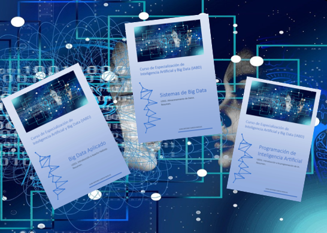

# Info_CE
## Información general para (futuros) alumnos de cursos de especialización.

 

Desde este repositorio, intentamos ofrecer desde un sitio único toda la información que nos hace falta como estudiantes para 
superar los Cursos de Especialización.

Es una iniciativa estudiantil que no pretende sustituir, reemplazar o mostrarse como algo oficial.

🌐 <em><b>Puedes acceder al sitio </b> <a href="https://jagmolar.github.io/Info_CE/" target="blank">web desde aquí</a> <b>. Espero que te guste!!</b> :)</em>

